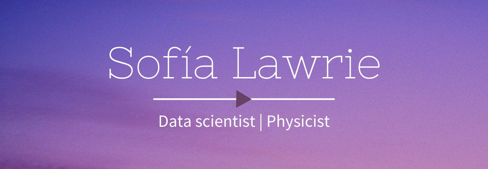

**About me**

PhD in Information and Communication Technologies looking to professionally venture into data science and machine learning for industrial and commercial applications. Research experience at the interphase between computational neuroscience and machine learning. Interested in practical approaches to real-world problem solving and data-driven solutions. Always up for the challenge of learning, particularly new technologies. Physicist by training, coder by design, teacher by heart.

